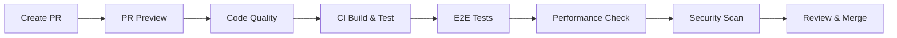
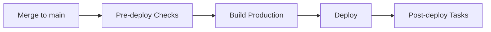

# 🚀 CI/CD Setup Guide

## Overview

Sistema completo de CI/CD configurado com GitHub Actions para automação de testes, qualidade de código e deploy.

## 📋 Workflows Configurados

### 1. **CI - Build & Test** (`.github/workflows/ci.yml`)
**Trigger**: Push e PR em `main` e `develop`

**Jobs**:
- ✅ **Quality Checks**: Type check, lint, formatação
- ✅ **Build**: Compilação da aplicação
- ✅ **Unit Tests**: Testes unitários com coverage

**Duração**: ~5-8 minutos

---

### 2. **E2E Tests** (`.github/workflows/e2e-tests.yml`)
**Trigger**: Push, PR e manual

**Jobs**:
- ✅ **Playwright Tests**: Testes end-to-end completos
- ✅ **Upload Reports**: Relatórios de teste e screenshots

**Duração**: ~10-15 minutos

---

### 3. **Deploy to Production** (`.github/workflows/deploy-production.yml`)
**Trigger**: Push em `main` e manual

**Jobs**:
- ✅ **Pre-deploy Checks**: Validações antes do deploy
- ✅ **Deploy**: Build e deploy de produção
- ✅ **Post-deploy**: Resumo e notificações

**Duração**: ~8-12 minutos

---

### 4. **PR Preview** (`.github/workflows/pr-preview.yml`)
**Trigger**: Abertura e atualização de PRs

**Jobs**:
- ✅ **PR Checks**: Validações de qualidade
- ✅ **Build Preview**: Build para revisão
- ✅ **Comment PR**: Comentário automático com métricas

**Duração**: ~5-7 minutos

---

### 5. **Security Scan** (`.github/workflows/security-scan.yml`)
**Trigger**: Push, PR e agendado (segundas-feiras)

**Jobs**:
- ✅ **npm audit**: Auditoria de vulnerabilidades
- ✅ **Dependency check**: Verificação de dependências

**Duração**: ~3-5 minutos

---

### 6. **Code Quality** (`.github/workflows/code-quality.yml`)
**Trigger**: Push, PR e agendado (segundas-feiras)

**Jobs**:
- ✅ **Complexity Analysis**: Análise de complexidade
- ✅ **TODO/FIXME Check**: Busca de pendências
- ✅ **Console Logs**: Verifica logs esquecidos
- ✅ **Unused Dependencies**: Dependências não utilizadas

**Duração**: ~4-6 minutos

---

### 7. **Dependency Updates** (`.github/workflows/dependency-update.yml`)
**Trigger**: Agendado (segundas-feiras) e manual

**Jobs**:
- ✅ **Check Updates**: Verifica pacotes desatualizados
- ✅ **Security Audit**: Auditoria de segurança
- ✅ **Create Issue**: Cria issue com relatório

**Duração**: ~2-3 minutos

---

### 8. **Performance Check** (`.github/workflows/performance-check.yml`)
**Trigger**: PRs e manual

**Jobs**:
- ✅ **Lighthouse CI**: Auditoria de performance
- ✅ **Bundle Analysis**: Análise de tamanho do bundle

**Duração**: ~6-8 minutos

---

## 🔐 Secrets Necessários

Configure os seguintes secrets no GitHub:

### Obrigatórios
```bash
VITE_SUPABASE_URL          # URL do Supabase
VITE_SUPABASE_ANON_KEY     # Chave anônima do Supabase
```

### Para Testes E2E
```bash
TEST_USER_EMAIL            # Email de usuário de teste
TEST_USER_PASSWORD         # Senha de usuário de teste
```

### Opcionais
```bash
CODECOV_TOKEN             # Para upload de coverage
VERCEL_TOKEN              # Para deploy no Vercel
VERCEL_ORG_ID             # ID da organização Vercel
VERCEL_PROJECT_ID         # ID do projeto Vercel
```

## 📝 Como Configurar Secrets

1. Acesse: `Settings` → `Secrets and variables` → `Actions`
2. Clique em `New repository secret`
3. Adicione nome e valor
4. Clique em `Add secret`

## 🎯 Workflow de Desenvolvimento

### Pull Request


### Deploy para Produção


## 🔍 Monitoramento

### GitHub Actions Dashboard
- Acesse: `Actions` tab no GitHub
- Visualize: Status de todos os workflows
- Filtre: Por workflow, branch, status

### Build Status Badges
Adicione ao README.md:
```markdown


```

## 🚨 Troubleshooting

### Build Falha
1. Verifique secrets configurados
2. Revise logs do workflow
3. Execute build localmente: `npm run build`

### Testes Falham
1. Verifique ambiente de teste
2. Execute testes localmente: `npm test`
3. Revise relatórios de teste

### Deploy Falha
1. Verifique pre-deploy checks
2. Revise configuração de ambiente
3. Confirme secrets de produção

## 📊 Métricas

### Objetivos de Performance
- ⏱️ **CI Build**: < 10 minutos
- ⏱️ **E2E Tests**: < 20 minutos
- ⏱️ **Deploy**: < 15 minutos
- 📦 **Bundle Size**: < 500KB (gzipped)
- 🎯 **Test Coverage**: > 80%

### Frequência de Execução
- **Por commit**: CI, E2E, Security
- **Por PR**: PR Preview, Performance
- **Semanal**: Code Quality, Dependency Updates
- **Por deploy**: Deploy Production

## 🔄 Manutenção

### Semanal
- ✅ Revisar relatórios de segurança
- ✅ Verificar atualizações de dependências
- ✅ Analisar métricas de performance

### Mensal
- ✅ Atualizar workflows
- ✅ Revisar e otimizar builds
- ✅ Limpar artifacts antigos

### Trimestral
- ✅ Audit completo de segurança
- ✅ Revisar e atualizar documentação
- ✅ Avaliar novas ferramentas

## 🎓 Recursos

- [GitHub Actions Docs](https://docs.github.com/en/actions)
- [Playwright Docs](https://playwright.dev/)
- [Lighthouse CI](https://github.com/GoogleChrome/lighthouse-ci)

## 📞 Suporte

Para problemas com CI/CD:
1. Verifique [GitHub Actions Status](https://www.githubstatus.com/)
2. Revise logs detalhados no GitHub
3. Consulte documentação de cada workflow
4. Abra issue com label `ci/cd`

---

**Status**: ✅ Configurado e Operacional  
**Última Atualização**: 08/11/2025  
**Versão**: 1.0.0
