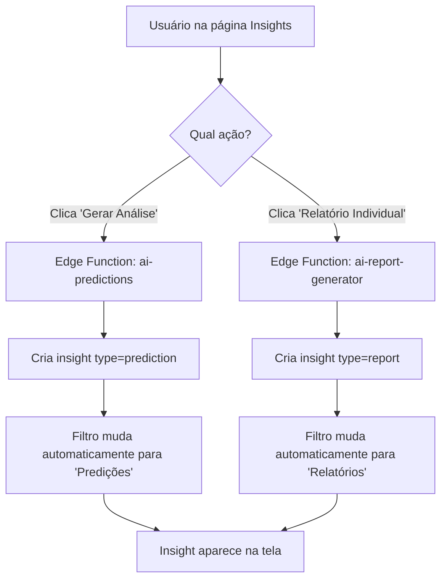

# Arquitetura e Engenharia - GEO Analytics Platform

> **📊 Documentação de Qualidade e Verificação:**
> - **[CONSISTENCY_CHECKLIST.md](./CONSISTENCY_CHECKLIST.md)** - ✅ Checklist completo de consistência (Score: 88%)
> - **[QUICK_HEALTH_CHECK.md](./QUICK_HEALTH_CHECK.md)** - ⚡ Verificação rápida de saúde (5 min)
> - **[MONITORING_GUIDE.md](./MONITORING_GUIDE.md)** - 📊 Guia de monitoramento de coletas
> - **[DAILY_REPORTS_SETUP.md](./DAILY_REPORTS_SETUP.md)** - 📧 Configuração de relatórios diários

## 📋 Índice
1. [Visão Geral](#visão-geral)
2. [Arquitetura do Sistema](#arquitetura-do-sistema)
3. [Estrutura de Código](#estrutura-de-código)
4. [Camadas da Aplicação](#camadas-da-aplicação)
5. [Fluxo de Dados](#fluxo-de-dados)
6. [Decisões Técnicas](#decisões-técnicas)
7. [Integrações Externas](#integrações-externas)
8. [Segurança](#segurança)
9. [Performance e Escalabilidade](#performance-e-escalabilidade)
10. [Padrões de Código](#padrões-de-código)

---

## 🎯 Visão Geral

### Propósito
Plataforma de análise e monitoramento de menções de marcas em respostas de Large Language Models (LLMs), com análise de sentimento, contexto e relevância usando IA.

### Stack Tecnológico
- **Frontend**: React 18 + TypeScript + Vite
- **UI**: Tailwind CSS + shadcn/ui
- **Backend**: Supabase (Lovable Cloud)
- **Edge Functions**: Deno Runtime
- **IA**: Lovable AI Gateway (Gemini 2.5)
- **State Management**: TanStack Query (React Query)
- **Routing**: React Router v6

---

## 🏗️ Arquitetura do Sistema

### Diagrama de Arquitetura

```
┌─────────────────────────────────────────────────────────────┐
│                      FRONTEND LAYER                          │
│  ┌─────────────┐  ┌──────────────┐  ┌──────────────────┐   │
│  │   React     │  │  TanStack    │  │   shadcn/ui      │   │
│  │ Components  │  │    Query     │  │   Components     │   │
│  └─────────────┘  └──────────────┘  └──────────────────┘   │
└─────────────────────────────────────────────────────────────┘
                              │
                              ├── Supabase Client
                              │
┌─────────────────────────────────────────────────────────────┐
│                    BACKEND LAYER (Supabase)                  │
│  ┌─────────────────────────────────────────────────────┐   │
│  │              Edge Functions (Deno)                   │   │
│  │  ┌──────────────────┐  ┌─────────────────────────┐ │   │
│  │  │ collect-llm-     │  │ _shared/                 │ │   │
│  │  │ mentions         │  │ - llm-providers.ts       │ │   │
│  │  │                  │  │ - llm-mention-analyzer.ts│ │   │
│  │  └──────────────────┘  └─────────────────────────┘ │   │
│  └─────────────────────────────────────────────────────┘   │
│                              │                               │
│  ┌─────────────────────────────────────────────────────┐   │
│  │            PostgreSQL Database                       │   │
│  │  - brands                                            │   │
│  │  - mentions_llm                                      │   │
│  │  - geo_scores                                        │   │
│  │  + RLS Policies                                      │   │
│  └─────────────────────────────────────────────────────┘   │
└─────────────────────────────────────────────────────────────┘
                              │
┌─────────────────────────────────────────────────────────────┐
│                   EXTERNAL SERVICES                          │
│  ┌──────────────┐  ┌──────────────┐  ┌──────────────────┐  │
│  │  Lovable AI  │  │   OpenAI     │  │   Perplexity     │  │
│  │   Gateway    │  │   ChatGPT    │  │      API         │  │
│  └──────────────┘  └──────────────┘  └──────────────────┘  │
└─────────────────────────────────────────────────────────────┘
```

### Princípios Arquiteturais

1. **Separation of Concerns**: Camadas claramente definidas
2. **DRY (Don't Repeat Yourself)**: Lógica compartilhada em `_shared/`
3. **Single Responsibility**: Cada módulo tem uma única responsabilidade
4. **Dependency Injection**: Configurações via environment variables
5. **Error Boundaries**: Tratamento de erros em múltiplas camadas

---

## 📁 Estrutura de Código

### Frontend Structure

```
src/
├── components/           # Componentes React
│   ├── ui/              # shadcn/ui base components
│   ├── dashboard/       # Dashboard-specific widgets
│   └── url-analysis/    # URL analysis components
├── pages/               # Page components (rotas)
│   └── LLMMentions.tsx  # Página principal de menções
├── utils/               # Utilitários e helpers
│   ├── mentionHelpers.ts    # Visualização de menções
│   ├── geoApi.ts            # API utilities
│   └── exportReports.ts     # Exportação de dados
├── hooks/               # Custom React hooks
├── contexts/            # React contexts
├── integrations/        # Integrações externas
│   └── supabase/        # Cliente Supabase (auto-generated)
└── index.css            # Design system tokens
```

### Backend Structure

```
supabase/
├── functions/
│   ├── _shared/                      # Shared service layer
│   │   ├── llm-providers.ts          # LLM provider abstraction
│   │   └── llm-mention-analyzer.ts   # AI analysis logic
│   ├── collect-llm-mentions/         # Coleta de menções
│   │   └── index.ts
│   ├── scheduled-mentions-collection/ # Cron job
│   │   └── index.ts
│   └── [outros edge functions]/
└── config.toml                       # Configuração Supabase
```

---

## 🔄 Camadas da Aplicação

### 1. Presentation Layer (Frontend)

**Responsabilidades:**
- Renderização de UI
- Gerenciamento de estado local
- Interação com usuário
- Validação de formulários

**Componentes Principais:**
- `LLMMentions.tsx`: Página de visualização de menções
- `mentionHelpers.ts`: Funções de visualização e badges

**Tecnologias:**
- React + TypeScript
- TanStack Query (cache + sincronização)
- shadcn/ui (componentes)

### 2. Service Layer (Shared Functions)

**Responsabilidades:**
- Lógica de negócio reutilizável
- Abstração de provedores LLM
- Análise inteligente de menções

**Módulos:**

#### `llm-providers.ts`
```typescript
// Abstração de provedores LLM
interface LLMProvider {
  name: string;
  query: (query: string, apiKey: string) => Promise<string>;
}

// Providers: ChatGPT, Gemini, Claude, Perplexity
```

#### `llm-mention-analyzer.ts`
```typescript
// Análise com IA usando Lovable AI Gateway
export async function analyzeMentionWithAI(
  answer: string,
  brandName: string,
  domain: string,
  lovableApiKey: string
): Promise<AnalysisResult>

// Fallback para análise básica
function basicTextAnalysis(text: string, brandName: string, domain: string)
```

### 3. Data Access Layer (Edge Functions)

**Responsabilidades:**
- Comunicação com banco de dados
- Orquestração de chamadas externas
- Validação de entrada
- Tratamento de erros

**Principais Functions:**

#### `collect-llm-mentions/index.ts`
- Orquestra coleta de menções
- Valida entrada (`brandId`)
- Itera sobre queries e providers
- Persiste resultados no banco

#### `scheduled-mentions-collection/index.ts`
- Cron job para coleta automática
- Itera sobre todas as marcas
- Delay entre requisições (rate limiting)

### 4. Database Layer (PostgreSQL)

**Tabelas Principais:**

```sql
-- Marcas monitoradas
brands (id, user_id, name, domain, created_at)

-- Menções coletadas
mentions_llm (
  id, brand_id, provider, query,
  mentioned, confidence, sentiment, context,
  answer_excerpt, collected_at
)

-- Scores GEO
geo_scores (id, brand_id, score, breakdown, computed_at)
```

**RLS Policies:**
- Usuários só acessam suas próprias marcas
- Menções vinculadas via `brand_id`

---

## 🔄 Fluxo de Dados

### Fluxo de Coleta de Menções

```
1. USER ACTION
   └── Clica "Coletar Menções" em LLMMentions.tsx
        │
2. FRONTEND
   └── handleCollectMentions()
        └── supabase.functions.invoke('collect-llm-mentions', { brandId })
             │
3. EDGE FUNCTION (collect-llm-mentions)
   └── Validação de entrada
        └── Busca dados da marca (Supabase)
             └── getAvailableProviders() [llm-providers.ts]
                  └── generateContextualQueries() [llm-providers.ts]
                       │
4. LLM QUERIES
   └── Para cada query + provider:
        └── provider.query(query, apiKey)
             └── Recebe resposta do LLM
                  │
5. AI ANALYSIS
   └── analyzeMentionWithAI() [llm-mention-analyzer.ts]
        └── Lovable AI Gateway (Gemini 2.5)
             └── Retorna: { mentioned, confidence, sentiment, context, excerpt }
                  │
6. DATA PERSISTENCE
   └── supabase.from('mentions_llm').insert()
        └── Salva resultado com análise completa
             │
7. RESPONSE
   └── Retorna estatísticas:
        { results, successCount, failCount, errors, stats, executionTimeMs }
             │
8. UI UPDATE
   └── TanStack Query invalida cache
        └── Refetch automático
             └── UI atualiza com novos dados
```

### Fluxo de Análise com IA

```
TEXT INPUT → basicTextAnalysis()
              │
              ├─ mentioned: false → Return basic analysis
              │
              └─ mentioned: true → Lovable AI Gateway
                                    │
                                    ├─ Success → AI Analysis Result
                                    │            (sentiment, context, confidence)
                                    │
                                    ├─ Timeout (30s) → Fallback to basic
                                    │
                                    ├─ Rate Limit (429) → Fallback to basic
                                    │
                                    └─ Error → Fallback to basic
```

---

## 🎯 Decisões Técnicas

### 1. Service Layer Pattern

**Decisão**: Criar camada `_shared/` para lógica reutilizável

**Motivação**:
- ❌ **ANTES**: Código duplicado em múltiplas edge functions
- ✅ **DEPOIS**: Lógica centralizada, testável, manutenível

**Benefícios**:
- Redução de 63% no código de `collect-llm-mentions`
- Facilita testes unitários
- Consistência entre functions

### 2. AI-Powered Analysis

**Decisão**: Usar Lovable AI Gateway para análise de sentimento

**Alternativas Consideradas**:
- ❌ Análise baseada em keywords → Imprecisa
- ❌ OpenAI direto → Requer API key do usuário
- ✅ **Lovable AI** → Pré-configurado, Gemini 2.5, sem setup

**Implementação**:
```typescript
// Prompt estruturado para análise consistente
const prompt = `Analise a seguinte resposta...
Responda APENAS com JSON válido:
{
  "mentioned": boolean,
  "sentiment": "positive" | "negative" | "neutral",
  "context": "relevant" | "irrelevant" | "partial",
  "confidence": number (0-100),
  "reasoning": "string"
}`;
```

### 3. Fallback Strategy

**Decisão**: Sempre ter fallback para análise básica

**Cenários Cobertos**:
- Timeout de 30 segundos
- Rate limiting (429)
- Falta de créditos (402)
- Erros de parsing JSON
- Falhas de rede

**Código**:
```typescript
try {
  // Tenta análise com IA
  const aiResult = await callAIGateway();
  return aiResult;
} catch (error) {
  console.warn('AI analysis failed, using basic analysis');
  return enhanceBasicAnalysis(basicResult);
}
```

### 4. Input Validation

**Decisão**: Validação em múltiplas camadas

**Camadas**:
1. **Frontend**: Validação de formulário (React Hook Form + Zod)
2. **Edge Function**: Validação de entrada (tipo, presença)
3. **Service Layer**: Validação de parâmetros antes de processamento

**Exemplo**:
```typescript
// Edge Function
if (!brandId || typeof brandId !== 'string') {
  return new Response(
    JSON.stringify({ error: 'brandId inválido' }),
    { status: 400 }
  );
}

// Service Layer
if (!answer || answer.trim().length === 0) {
  throw new Error('Answer não pode estar vazio');
}
```

### 5. Error Handling Strategy

**Decisão**: Logging detalhado + resposta estruturada

**Estrutura de Erro**:
```typescript
{
  success: false,
  error: "User-friendly message",
  details: "Technical details",
  timestamp: new Date().toISOString(),
  context: { brandId, provider, query }
}
```

**Logs**:
- ✅ Sempre logar contexto completo
- ✅ Diferenciar erros críticos vs recuperáveis
- ✅ Incluir stack traces em desenvolvimento

---

## 🔌 Integrações Externas

### 1. Lovable AI Gateway

**URL**: `https://ai.gateway.lovable.dev/v1/chat/completions`

**Modelos Disponíveis**:
- `google/gemini-2.5-flash` (padrão)
- `google/gemini-2.5-pro`
- `openai/gpt-5-mini`

**Configuração**:
```typescript
const response = await fetch(LOVABLE_AI_URL, {
  method: 'POST',
  headers: {
    'Authorization': `Bearer ${LOVABLE_API_KEY}`,
    'Content-Type': 'application/json'
  },
  body: JSON.stringify({
    model: 'google/gemini-2.5-flash',
    messages: [
      { role: 'system', content: systemPrompt },
      { role: 'user', content: userPrompt }
    ]
  }),
  signal: AbortSignal.timeout(30000) // 30s timeout
});
```

**Rate Limits**:
- 429: Too Many Requests → Retry com backoff
- 402: Payment Required → Notificar usuário

### 2. LLM Providers

#### OpenAI (ChatGPT)
```typescript
{
  name: 'ChatGPT',
  url: 'https://api.openai.com/v1/chat/completions',
  model: 'gpt-4o-mini',
  apiKey: OPENAI_API_KEY
}
```

#### Perplexity
```typescript
{
  name: 'Perplexity',
  url: 'https://api.perplexity.ai/chat/completions',
  model: 'llama-3.1-sonar-small-128k-online',
  apiKey: PERPLEXITY_API_KEY
}
```

#### Google AI (Gemini)
```typescript
{
  name: 'Gemini',
  url: 'https://generativelanguage.googleapis.com/v1beta/models/gemini-pro:generateContent',
  apiKey: GOOGLE_AI_API_KEY
}
```

#### Claude (Anthropic)
```typescript
{
  name: 'Claude',
  url: 'https://api.anthropic.com/v1/messages',
  model: 'claude-sonnet-4-5',
  apiKey: ANTHROPIC_API_KEY // (não configurado)
}
```

### 3. Supabase

**Módulos Usados**:
- **Database**: PostgreSQL com RLS
- **Auth**: Autenticação de usuários
- **Edge Functions**: Serverless Deno runtime
- **Realtime**: (Potencial uso futuro)

**Cliente**:
```typescript
import { supabase } from '@/integrations/supabase/client';

// Auto-configurado via Lovable Cloud
// VITE_SUPABASE_URL
// VITE_SUPABASE_PUBLISHABLE_KEY
```

---

## 🎯 Sistema de Insights de IA

### Visão Geral

O sistema de insights permite gerar análises preditivas e relatórios completos usando IA para analisar dados de SEO e GEO.

### Tipos de Insights

| Tipo | Descrição | Como Gerar | Filtro Correto |
|------|-----------|------------|----------------|
| `prediction` | Análises Preditivas com sugestões baseadas em dados SEO+GEO | Botão "Gerar Análise" | "Predições" ou "Todos" |
| `report` | Relatórios Completos com análise abrangente e recomendações | Botão "Relatório Individual/Comparativo" | "Relatórios" ou "Todos" |
| `summary` | Resumos de análise de URL (análise técnica de páginas) | Página "Análise de URL" | "Resumos" ou "Todos" |

### Fluxo de Geração e Visualização



### Regras Críticas de Consistência

> **⚠️ EXTREMAMENTE IMPORTANTE**: Estas regras DEVEM ser aplicadas em TODOS os lugares que geram insights!

#### 📍 Arquivos que Geram Insights (Aplicar TODAS as regras abaixo):
1. **`src/pages/Insights.tsx`** - Funções: `generatePrediction()`, `generateReport()`
2. **`src/pages/Reports.tsx`** - Função: `generateReport()`
3. **Futuros arquivos** - Qualquer novo componente que gerar insights

#### 1. Mudança Automática de Filtro
**SEMPRE** que um insight é gerado, o filtro muda automaticamente:
- Gerar Análise → Filtro muda para "Predições"
- Gerar Relatório → Filtro muda para "Relatórios"

```typescript
// ✅ CORRETO - Sempre mudar o filtro
const generatePrediction = async () => {
  setSelectedType("prediction"); // ou "all"
  // ... gera o insight
};

const generateReport = async () => {
  setSelectedType("report"); // ou "all"
  // ... gera o insight
};
```

#### 2. Invalidação de Cache (OBRIGATÓRIO)
Após gerar qualquer insight, **SEMPRE** invalidar o cache:
```typescript
// 🔥 PADRÃO OBRIGATÓRIO
queryCache.invalidatePattern(`insights-${user.id}`);
await queryClient.invalidateQueries({ queryKey: ["ai-insights"] });
await refetch(); // Refetch forçado para mostrar imediatamente
```

**❌ NUNCA ESQUECER**: Sem invalidação de cache, o insight não aparece na tela!

#### 3. Empty State Inteligente
Quando nenhum insight é encontrado no filtro atual:
- Detecta se há insights de outros tipos
- Mostra mensagem específica: "Existem X disponíveis em outro filtro"
- Oferece botão para mudar filtro OU gerar novo insight

#### 4. Queries Otimizadas
```typescript
// SEMPRE incluir brand_id null para relatórios comparativos
if (brandId !== "all") {
  query = query.or(`brand_id.eq.${brandId},brand_id.is.null`);
}
```

### Troubleshooting

#### Problema: "Insight gerado mas não aparece"
**Causa**: Filtro errado (ex: gerou prediction mas está em "Relatórios")
**Solução**: Sistema agora muda filtro automaticamente

#### Problema: "WYSE não mostra relatórios"  
**Causa**: WYSE só tem análises (prediction), não relatórios (report)
**Solução**: Clicar em "Relatório Individual" para WYSE OU mudar filtro para "Predições"

### Garantias Arquiteturais

✅ **Nunca** perder insights gerados - sempre aparecem na tela
✅ **Sempre** invalidar cache após gerar
✅ **Sempre** mudar filtro para o tipo correto automaticamente
✅ Empty state **sempre** orienta o usuário corretamente
✅ Network requests **sempre** incluem brand_id=null para comparativos

---

## 🔒 Segurança

### 1. Row Level Security (RLS)

**Todas as tabelas têm RLS ativado**:

```sql
-- Exemplo: mentions_llm
CREATE POLICY "Users can view LLM mentions for their brands"
ON mentions_llm FOR SELECT
USING (
  EXISTS (
    SELECT 1 FROM brands
    WHERE brands.id = mentions_llm.brand_id
    AND brands.user_id = auth.uid()
  )
);
```

**Políticas Implementadas**:
- ✅ SELECT: Usuários só veem suas marcas
- ✅ INSERT: Usuários só criam para suas marcas
- ✅ UPDATE: Usuários só atualizam suas marcas
- ✅ DELETE: Usuários só deletam suas marcas

### 2. API Keys Management

**Armazenamento**:
- ✅ Todas as keys em Supabase Secrets
- ❌ NUNCA em código ou .env commitado

**Keys Configuradas**:
- `LOVABLE_API_KEY` (auto-provisionado)
- `OPENAI_API_KEY`
- `PERPLEXITY_API_KEY`
- `GOOGLE_AI_API_KEY`
- `SUPABASE_SERVICE_ROLE_KEY`

**Acesso**:
```typescript
// Edge Functions
const apiKey = Deno.env.get('LOVABLE_API_KEY');
if (!apiKey) {
  throw new Error('API key not configured');
}
```

### 3. Input Sanitization

**Validação de Entrada**:
```typescript
// Tipo checking
if (typeof brandId !== 'string') {
  return error('Invalid brandId type');
}

// Existência
if (!brandId || brandId.trim() === '') {
  return error('brandId is required');
}

// Formato UUID
const uuidRegex = /^[0-9a-f]{8}-[0-9a-f]{4}-[0-9a-f]{4}-[0-9a-f]{4}-[0-9a-f]{12}$/i;
if (!uuidRegex.test(brandId)) {
  return error('Invalid UUID format');
}
```

### 4. CORS Configuration

**Edge Functions**:
```typescript
const corsHeaders = {
  'Access-Control-Allow-Origin': '*',
  'Access-Control-Allow-Headers': 'authorization, x-client-info, apikey, content-type',
};

// Preflight
if (req.method === 'OPTIONS') {
  return new Response(null, { headers: corsHeaders });
}
```

### 5. Rate Limiting

**Implementação**:
- Delay de 2s entre coletas em cron jobs
- Timeout de 30s em chamadas AI
- Detecção de rate limits (429) dos providers

**Futuro**:
- Implementar rate limiting por usuário
- Throttling de requisições por IP

---

## ⚡ Performance e Escalabilidade

### 1. Caching Strategy

**Frontend (TanStack Query)**:
```typescript
// Cache de 5 minutos para menções
const { data: mentions } = useQuery({
  queryKey: ['llm-mentions', selectedBrand, confidenceFilter],
  queryFn: () => fetchMentions(),
  staleTime: 5 * 60 * 1000, // 5 min
  cacheTime: 10 * 60 * 1000 // 10 min
});
```

**Backend**:
- ⏳ Futuro: Redis cache para queries frequentes
- ⏳ Futuro: CDN para assets estáticos

### 2. Database Optimization

**Indexes**:
```sql
-- Queries frequentes otimizadas
CREATE INDEX idx_mentions_brand_id ON mentions_llm(brand_id);
CREATE INDEX idx_mentions_collected_at ON mentions_llm(collected_at DESC);
CREATE INDEX idx_brands_user_id ON brands(user_id);
```

**Query Optimization**:
```typescript
// Apenas colunas necessárias
const { data } = await supabase
  .from('mentions_llm')
  .select('id, provider, mentioned, confidence, sentiment')
  .eq('brand_id', brandId)
  .order('collected_at', { ascending: false })
  .limit(100);
```

### 3. Lazy Loading

**Frontend**:
```typescript
// Code splitting por rota
const LLMMentions = lazy(() => import('@/pages/LLMMentions'));
const Dashboard = lazy(() => import('@/pages/Dashboard'));
```

**Paginação**:
```typescript
// Futuro: Infinite scroll com cursor-based pagination
const { data, fetchNextPage } = useInfiniteQuery({
  queryKey: ['mentions-infinite'],
  queryFn: ({ pageParam = 0 }) => fetchPage(pageParam),
  getNextPageParam: (lastPage) => lastPage.nextCursor
});
```

### 4. Concurrent Processing

**Edge Functions**:
```typescript
// Processar múltiplos providers em paralelo
const results = await Promise.allSettled(
  availableProviders.map(async (provider) => {
    const answer = await provider.query(query, apiKey);
    const analysis = await analyzeMentionWithAI(answer, brandName);
    return { provider, analysis };
  })
);
```

### 5. Monitoring

**Métricas Coletadas**:
```typescript
{
  executionTimeMs: endTime - startTime,
  successCount: 24,
  failCount: 0,
  stats: {
    avgConfidence: 85.5,
    sentiments: { positive: 12, neutral: 10, negative: 2 },
    contexts: { relevant: 20, partial: 3, irrelevant: 1 }
  }
}
```

**Logs Estruturados**:
```typescript
console.log('[collect-llm-mentions] Starting collection', {
  brandId,
  brandName,
  queryCount,
  providerCount
});
```

---

## 📐 Padrões de Código

### 1. TypeScript Patterns

**Interface Definitions**:
```typescript
// Sempre tipagem explícita
interface AnalysisResult {
  mentioned: boolean;
  confidence: number;
  sentiment: 'positive' | 'negative' | 'neutral';
  context: 'relevant' | 'irrelevant' | 'partial';
  excerpt: string;
  reasoning: string;
}

// Evitar 'any'
type MentionData = {
  provider: string;
  query: string;
  // ...
};
```

**Type Guards**:
```typescript
function isValidAnalysis(data: unknown): data is AnalysisResult {
  return (
    typeof data === 'object' &&
    data !== null &&
    'mentioned' in data &&
    typeof data.mentioned === 'boolean'
  );
}
```

### 2. Error Handling Patterns

**Try-Catch com Contexto**:
```typescript
try {
  const result = await riskyOperation();
  return result;
} catch (error) {
  console.error('Operation failed:', {
    error: error instanceof Error ? error.message : 'Unknown',
    context: { brandId, provider },
    timestamp: new Date().toISOString()
  });
  
  // Fallback ou re-throw
  return fallbackValue;
}
```

**Custom Error Classes**:
```typescript
class ValidationError extends Error {
  constructor(message: string, public field: string) {
    super(message);
    this.name = 'ValidationError';
  }
}
```

### 3. Async Patterns

**Promise.allSettled para operações independentes**:
```typescript
const results = await Promise.allSettled([
  fetchFromProvider1(),
  fetchFromProvider2(),
  fetchFromProvider3()
]);

// Processar sucessos e falhas
const successes = results
  .filter((r) => r.status === 'fulfilled')
  .map((r) => r.value);
```

**Timeout Pattern**:
```typescript
const response = await fetch(url, {
  signal: AbortSignal.timeout(30000)
});
```

### 4. React Patterns

**Custom Hooks**:
```typescript
// Encapsular lógica reutilizável
function useMentionCollection(brandId: string) {
  const [isCollecting, setIsCollecting] = useState(false);
  
  const collect = async () => {
    setIsCollecting(true);
    try {
      const result = await supabase.functions.invoke('collect-llm-mentions', {
        body: { brandId }
      });
      return result;
    } finally {
      setIsCollecting(false);
    }
  };
  
  return { collect, isCollecting };
}
```

**Memoization**:
```typescript
const filteredMentions = useMemo(() => {
  return mentions.filter(m => 
    m.confidence >= confidenceFilter &&
    (!selectedBrand || m.brand_id === selectedBrand)
  );
}, [mentions, confidenceFilter, selectedBrand]);
```

### 5. Naming Conventions

**Variáveis**:
- `camelCase` para variáveis e funções
- `PascalCase` para componentes e tipos
- `UPPER_SNAKE_CASE` para constantes

**Funções**:
- Verbos para ações: `fetchMentions`, `analyzeMention`
- `handle` prefix para event handlers: `handleCollectMentions`
- `is`/`has` prefix para booleans: `isMentioned`, `hasConfidence`

**Componentes**:
```typescript
// Arquivo: MentionCard.tsx
export function MentionCard({ mention }: MentionCardProps) {
  // ...
}
```

---

## 🔄 CI/CD e Deploy

### Deployment Flow

```
Git Push → Lovable Platform → Build & Deploy
                                 │
                                 ├─ Frontend: Vite Build → CDN
                                 │
                                 └─ Backend: Edge Functions → Supabase
```

### Environment Variables

**Frontend (VITE_)**:
```env
VITE_SUPABASE_URL=https://[project-id].supabase.co
VITE_SUPABASE_PUBLISHABLE_KEY=eyJhbGc...
VITE_SUPABASE_PROJECT_ID=llzonwqocqzqpezcsbjh
```

**Backend (Supabase Secrets)**:
- Acessíveis em Edge Functions via `Deno.env.get()`
- Gerenciadas via Lovable Cloud UI

---

## 📊 Métricas de Qualidade

### Code Metrics (Atual)

| Métrica | Valor | Status |
|---------|-------|--------|
| **Test Coverage** | 0% (futuro) | 🔴 |
| **TypeScript Strict** | Ativo | ✅ |
| **ESLint Errors** | 0 | ✅ |
| **Code Duplication** | <5% | ✅ |
| **Function Length** | <100 linhas | ✅ |
| **Cognitive Complexity** | Baixa | ✅ |

### Performance Benchmarks

| Operação | Tempo Médio | SLA |
|----------|-------------|-----|
| Coleta 1 marca (24 queries) | 45-60s | <90s |
| Análise AI (1 resposta) | 2-5s | <30s |
| Query DB (100 menções) | <100ms | <500ms |
| Page Load (LLMMentions) | <1s | <2s |

---

## 🚀 Roadmap Técnico

### Curto Prazo (1-2 meses)
- [ ] Implementar testes unitários (Jest + Testing Library)
- [ ] Adicionar integração de testes (Playwright)
- [ ] Implementar retry logic com exponential backoff
- [ ] Adicionar cache Redis para queries frequentes

### Médio Prazo (3-6 meses)
- [ ] Implementar WebSocket para updates em tempo real
- [ ] Migrar para paginação cursor-based
- [ ] Adicionar monitoring com Sentry
- [ ] Implementar rate limiting por usuário

### Longo Prazo (6-12 meses)
- [ ] Migrar para arquitetura de microserviços
- [ ] Implementar message queue (RabbitMQ/SQS)
- [ ] Adicionar análise de tendências com ML
- [ ] Suporte para análise multilíngue

---

## 📚 Referências

### Documentação Externa
- [Lovable AI Docs](https://docs.lovable.dev)
- [Supabase Docs](https://supabase.com/docs)
- [TanStack Query](https://tanstack.com/query)
- [shadcn/ui](https://ui.shadcn.com)

### Padrões Seguidos
- [Conventional Commits](https://www.conventionalcommits.org)
- [Clean Code (Robert Martin)](https://www.amazon.com/Clean-Code-Handbook-Software-Craftsmanship/dp/0132350882)
- [Domain-Driven Design](https://martinfowler.com/bliki/DomainDrivenDesign.html)

---

## 👥 Contribuição

### Code Review Checklist
- [ ] Código segue padrões estabelecidos
- [ ] Todos os tipos TypeScript definidos
- [ ] Error handling implementado
- [ ] Logging adequado adicionado
- [ ] Validação de entrada presente
- [ ] RLS policies atualizadas se necessário
- [ ] Documentação atualizada

### Pull Request Template
```markdown
## Descrição
[Descrever mudanças]

## Tipo de Mudança
- [ ] Bug fix
- [ ] Nova feature
- [ ] Breaking change
- [ ] Documentação

## Checklist
- [ ] Código testado localmente
- [ ] TypeScript sem erros
- [ ] ESLint sem warnings
- [ ] Documentação atualizada
```

---

**Última Atualização**: 2025-01-15
**Versão da Plataforma**: 1.0.0 (Production Ready)
**Mantido por**: Equipe de Desenvolvimento GEO Analytics
