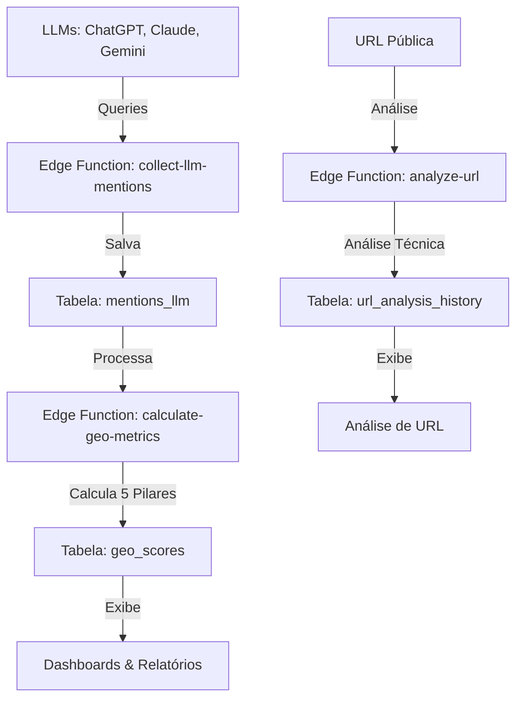

# Padrão de GEO Score - Documentação Oficial

## ⚠️ REGRA PERMANENTE - NÃO MODIFICAR

Este documento estabelece o padrão obrigatório para uso de GEO Scores em todo o sistema.

---

## 1. Duas Fontes de Dados, Dois Significados Diferentes

### 📊 GEO Score REAL (geo_scores.score)
**Fonte:** Tabela `geo_scores`  
**Origem:** Menções reais em LLMs (tabela `mentions_llm`)  
**Cálculo:** Edge function `calculate-geo-metrics`  
**Fórmula:** 5 pilares conforme `CALCULATION_SPEC.md`

**Este é o valor CORRETO para:**
- ✅ Dashboards
- ✅ Relatórios GEO
- ✅ Comparações de marcas
- ✅ Alertas e notificações
- ✅ Página GEO Scores
- ✅ Página SEO Scores (para comparação SEO vs GEO)

### 🔧 GEO Score Técnico (url_analysis_history.geo_score)
**Fonte:** Tabela `url_analysis_history`  
**Origem:** Análise técnica estática do site  
**Cálculo:** Edge function `analyze-url`  
**Fórmula:** Análise de estrutura HTML, meta tags, schema markup

**Este é o valor usado APENAS para:**
- ✅ Análise técnica de URL única
- ✅ Sugestões de otimização técnica
- ⚠️ **NÃO usar para métricas de desempenho de marca**

---

## 2. Função Utilitária Obrigatória

**Arquivo:** `src/utils/geoScoreHelper.ts`

```typescript
import { getRealGeoScore } from '@/utils/geoScoreHelper';

// ✅ CORRETO - Buscar GEO Score real
const geoScore = await getRealGeoScore(brandId);

// ❌ ERRADO - Usar geo_score de url_analysis_history para métricas
const { data } = await supabase
  .from('url_analysis_history')
  .select('geo_score');
```

---

## 3. Arquivos que Implementam o Padrão

### ✅ Implementação Correta
1. **src/pages/SeoScores.tsx**
   - Busca GEO Score real de `geo_scores`
   - Substitui o valor técnico ao exibir dados
   
2. **src/pages/GeoMetrics.tsx**
   - Usa diretamente `geo_scores`
   
3. **src/pages/Scores.tsx**
   - Usa diretamente `geo_scores`

4. **src/pages/ReportsGeo.tsx**
   - Usa diretamente `geo_scores`

### ⚠️ Exceções Válidas
1. **src/pages/UrlAnalysis.tsx**
   - Usa `url_analysis_history.geo_score` apenas para análise técnica
   - Quando há brand_id disponível, também mostra GEO Score real

2. **src/components/url-analysis/AnalysisHistory.tsx**
   - Exibe histórico de análises técnicas
   - Contexto: otimização técnica, não métricas de marca

---

## 4. Checklist de Implementação

Ao criar ou modificar componentes que exibem GEO Score:

- [ ] **Identificar o contexto:**
  - É para métricas de marca? → Usar `geo_scores`
  - É para análise técnica de URL? → Pode usar `url_analysis_history`

- [ ] **Usar função utilitária:**
  ```typescript
  import { getRealGeoScore } from '@/utils/geoScoreHelper';
  ```

- [ ] **Documentar no código:**
  ```typescript
  // Buscar GEO Score REAL baseado em menções LLM
  const realGeoScore = await getRealGeoScore(brandId);
  ```

- [ ] **Testes:**
  - Verificar se o valor exibido corresponde à página GEO Scores
  - Verificar se o valor exibido corresponde aos Relatórios GEO

---

## 5. Fluxo de Dados



---

## 6. Exemplos de Uso Correto

### Dashboard
```typescript
// ✅ CORRETO
const { data: geoScore } = await supabase
  .from('geo_scores')
  .select('score, breakdown')
  .eq('brand_id', brandId)
  .order('computed_at', { ascending: false })
  .limit(1)
  .single();
```

### Relatórios
```typescript
// ✅ CORRETO
const { data: scores } = await supabase
  .from('geo_scores')
  .select('*')
  .eq('brand_id', brandId)
  .order('computed_at', { ascending: false });
```

### Comparação SEO vs GEO
```typescript
// ✅ CORRETO - Buscar ambos separadamente
const { data: seoData } = await supabase
  .from('url_analysis_history')
  .select('seo_score')
  .limit(1);

const { data: geoData } = await supabase
  .from('geo_scores')
  .select('score')
  .eq('brand_id', brandId)
  .limit(1)
  .single();

// Substituir geo_score técnico com GEO Score real
const analysis = {
  ...seoData,
  geo_score: geoData?.score || 0
};
```

---

## 7. Histórico de Correções

| Data | Problema | Solução |
|------|----------|---------|
| 06/11/2025 | SEO Scores mostrava geo_score técnico diferente do real | Implementado `geoScoreHelper.ts` e correção em SeoScores.tsx |

---

## 8. Responsabilidades

### Backend (Edge Functions)
- `calculate-geo-metrics`: Calcular e salvar em `geo_scores`
- `analyze-url`: Calcular análise técnica em `url_analysis_history`

### Frontend (React)
- Usar `geoScoreHelper.ts` para buscar GEO Scores reais
- Nunca usar `url_analysis_history.geo_score` para métricas de marca

---

**Última atualização:** 06/11/2025  
**Status:** ✅ ATIVO E OBRIGATÓRIO  
**Manutenção:** Este padrão deve ser seguido permanentemente
