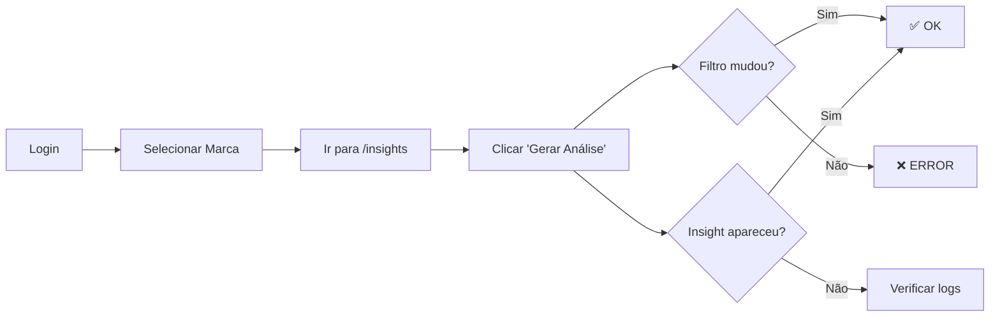

# 🏥 Quick Health Check - Verificação Rápida

> **Use este guia para verificação rápida (5 min) do status da plataforma**

---

## ⚡ VERIFICAÇÃO RÁPIDA (2 minutos)

### 1️⃣ Backend está rodando?
```bash
# Abrir Lovable Cloud Backend
```
✅ Ver se há erros recentes  
✅ Verificar se edge functions estão deployed

### 2️⃣ Insights estão gerando?
1. Ir para `/insights`
2. Selecionar uma marca
3. Clicar "Gerar Análise"
4. **Esperar 10-20 segundos**
5. ✅ Verificar se aparece na lista

### 3️⃣ Dados estão carregando?
- `/dashboard` → Ver cards com números
- `/brands` → Ver lista de marcas
- `/llm-mentions` → Ver menções
- `/geo-metrics` → Ver scores

---

## 🔍 VERIFICAÇÃO DETALHADA (5 minutos)

### Test Flow: Gerar Insight Completo



### Checklist Rápido

#### ✅ Interface
- [ ] Dashboard carrega em < 3 segundos
- [ ] Sidebar abre/fecha corretamente
- [ ] Breadcrumbs mostram path correto
- [ ] Toast notifications funcionam

#### ✅ Dados
- [ ] Marcas aparecem no selector
- [ ] Métricas mostram valores reais
- [ ] Gráficos renderizam
- [ ] Empty states aparecem quando não há dados

#### ✅ Insights IA
- [ ] Botão "Gerar Análise" está habilitado
- [ ] Loading state aparece durante geração
- [ ] Filtro muda automaticamente após gerar
- [ ] Insight aparece na lista imediatamente

#### ✅ Navegação
- [ ] Todas as rotas funcionam
- [ ] Voltar/avançar do browser funciona
- [ ] Links internos funcionam
- [ ] Protected routes redirecionam se não autenticado

---

## 🚨 SINAIS DE PROBLEMA

### 🔴 CRÍTICO (Resolver Imediatamente)

| Sintoma | Possível Causa | Ação |
|---------|----------------|------|
| Login não funciona | Auth down | Verificar Supabase status |
| 500 errors em tudo | Edge function erro | Verificar logs edge functions |
| Dados não carregam | RLS bloqueando | Verificar políticas RLS |
| Insight não aparece | Cache não invalidado | Verificar código de invalidação |

### 🟡 ATENÇÃO (Monitorar)

| Sintoma | Possível Causa | Ação |
|---------|----------------|------|
| Lentidão geral | Queries não otimizadas | Verificar queries lentas |
| Loading infinito | Promise não resolvida | Verificar console errors |
| Toast de erro | Edge function timeout | Aumentar timeout ou otimizar |

---

## 🔧 COMANDOS ÚTEIS

### Ver Status do Banco
```sql
-- Verificar se há insights recentes
SELECT 
  type,
  COUNT(*) as total,
  MAX(created_at) as ultimo
FROM ai_insights
WHERE user_id = 'YOUR_USER_ID'
GROUP BY type;

-- Verificar marcas
SELECT id, name, domain, created_at 
FROM brands 
ORDER BY created_at DESC 
LIMIT 5;

-- Verificar menções recentes
SELECT 
  COUNT(*) as total_mentions,
  MAX(collected_at) as ultima_coleta
FROM mentions_llm;
```

### Limpar Cache Manualmente
```javascript
// No console do browser
localStorage.clear();
sessionStorage.clear();
location.reload();
```

---

## 📊 MÉTRICAS DE SAÚDE

### KPIs para Monitorar

| Métrica | Target | Crítico Se |
|---------|--------|-----------|
| Tempo de carregamento Dashboard | < 2s | > 5s |
| Tempo de geração de insight | < 30s | > 60s |
| Taxa de erro edge functions | < 1% | > 5% |
| Uptime | > 99.5% | < 99% |

### Onde Ver as Métricas
1. **Lovable Cloud Logs** - Erros de edge functions
2. **Browser DevTools** - Performance frontend
3. **Network Tab** - Tempo de requests
4. **Console** - Erros JavaScript

---

## 🎯 TESTE DE FUMAÇA (Smoke Test)

Execute este teste após qualquer mudança grande:

### 1. Login Flow
```
1. Abrir /auth
2. Fazer login
3. ✅ Redireciona para /dashboard
```

### 2. Data Flow
```
1. Ir para /brands
2. ✅ Ver lista de marcas
3. Selecionar uma marca
4. Ir para /geo-metrics
5. ✅ Ver scores da marca
```

### 3. Insight Flow
```
1. Ir para /insights
2. Selecionar marca
3. Clicar "Gerar Análise"
4. ✅ Ver loading
5. ✅ Ver filtro mudar para "Predições"
6. ✅ Ver insight aparecer
```

### 4. Navigation Flow
```
1. Testar todas as rotas principais
2. ✅ Breadcrumbs corretos
3. ✅ Sidebar highlight correto
4. ✅ Nenhum 404
```

---

## 🐛 DEBUG RÁPIDO

### Insight não aparece?

```typescript
// 1. Verificar se foi criado no banco
console.log('Checking database...');

// 2. Verificar cache
queryCache.get(`insights-${userId}`);

// 3. Forçar refetch
queryClient.invalidateQueries({ queryKey: ['ai-insights'] });

// 4. Ver console errors
// Abrir DevTools > Console
```

### Edge Function falhando?

```typescript
// 1. Ver logs
// Lovable Cloud > Functions > [function-name] > Logs

// 2. Testar localmente
supabase functions serve

// 3. Ver payload
console.log('Request body:', request.body);
```

---

## ✅ CHECKLIST PÓS-DEPLOY

Após fazer deploy de mudanças:

- [ ] Build passou sem erros
- [ ] Smoke test passou
- [ ] Verificar logs por 5 minutos
- [ ] Testar em incognito (cache limpo)
- [ ] Testar em mobile
- [ ] Verificar métricas baseline

---

## 📞 QUANDO PEDIR AJUDA

Reporte um problema se:

1. ❌ Smoke test falha em > 50% dos casos
2. ❌ Edge function com error rate > 10%
3. ❌ Dados não carregam para nenhum usuário
4. ❌ Sistema inacessível por > 5 minutos

### Template de Bug Report

```markdown
**Problema:** [Descrição curta]

**Reproduzir:**
1. [Passo 1]
2. [Passo 2]
3. [Passo 3]

**Esperado:** [O que deveria acontecer]
**Aconteceu:** [O que realmente aconteceu]

**Logs:**
[Colar erros relevantes]

**Browser:** [Chrome/Firefox/Safari]
**Rota:** [/insights]
**Timestamp:** [2025-11-05 10:30]
```

---

**⏱️ Tempo total desta verificação: 5 minutos**  
**📅 Fazer diariamente antes de trabalhar na plataforma**
