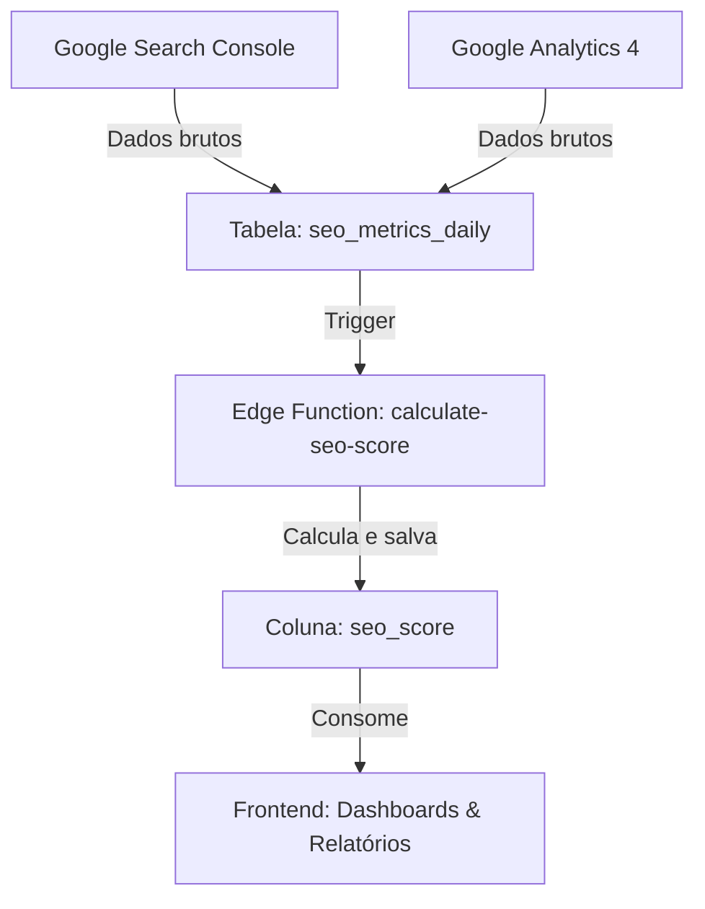

# Padrão de SEO Score - Documentação Oficial

## ⚠️ REGRA PERMANENTE - NÃO MODIFICAR

Este documento estabelece o padrão obrigatório para cálculo e uso de SEO Scores em todo o sistema.

---

## 1. Centralização do Cálculo

### 🎯 Edge Function: `calculate-seo-score`
**Localização:** `supabase/functions/calculate-seo-score/index.ts`  
**Responsabilidade:** Único ponto de cálculo do SEO Score  
**Armazenamento:** Coluna `seo_score` na tabela `seo_metrics_daily`

### 📊 Fórmula Oficial (0-100 pontos)

```typescript
SEO Score = (posição_score × 0.4) + (ctr_score × 0.3) + (conversão_score × 0.3)
```

**Componentes:**

1. **Posição Score (40%):**
   ```typescript
   posição_score = max(0, 100 - ((avg_position - 1) × 11.11))
   // Posição 1 = 100 pontos
   // Posição 10 = 0 pontos
   ```

2. **CTR Score (30%):**
   ```typescript
   ctr_score = min(100, (ctr_percent / 5) × 100)
   // CTR de 5% = 100 pontos
   // CTR no banco é decimal: 0.028 = 2.8%
   ```

3. **Conversão Score (30%):**
   ```typescript
   conversão_score = min(100, (conversão_percent / 5) × 100)
   // Conversão de 5% = 100 pontos
   // Conversão no banco é decimal: 0.03 = 3%
   ```

---

## 2. Fluxo de Dados



---

## 3. Função Utilitária Obrigatória

**Arquivo:** `src/utils/seoScoreHelper.ts`

```typescript
import { getSeoScore } from '@/utils/seoScoreHelper';

// ✅ CORRETO - Buscar SEO Score pré-calculado
const seoScore = await getSeoScore(brandId);

// ❌ ERRADO - Calcular localmente
const seoScore = calculateSeoScore(metrics);
```

### Funções Disponíveis:

- `getSeoScore(brandId)` - Busca score mais recente
- `getLatestSeoMetrics(brandId)` - Busca métricas completas
- `getSeoScoreHistory(brandId, limit)` - Busca histórico
- `hasSeoScore(brandId)` - Verifica se existe score
- `recalculateSeoScore(brandId)` - Força recálculo

---

## 4. Arquivos que Implementam o Padrão

### ✅ Implementação Correta

1. **supabase/functions/calculate-seo-score/index.ts**
   - Cálculo centralizado
   - Salva em `seo_metrics_daily.seo_score`

2. **src/pages/GeoMetrics.tsx**
   - Consome score pré-calculado
   - Não calcula localmente

3. **src/pages/SeoScores.tsx**
   - Consome score pré-calculado
   - Não calcula localmente

4. **src/pages/SeoMetrics.tsx**
   - Invoca edge function após coleta de dados
   - Exibe métricas brutas (não calcula score)

### ⚠️ Proibido

- ❌ Calcular SEO Score localmente em componentes
- ❌ Criar fórmulas diferentes em múltiplos lugares
- ❌ Modificar a fórmula sem atualizar a edge function

---

## 5. Quando Recalcular o SEO Score

O SEO Score deve ser recalculado automaticamente quando:

1. **Coleta de métricas SEO:** Após `collect-seo-metrics`
2. **Atualização manual:** Botão "Atualizar Dados" em GeoMetrics
3. **Mudança nas métricas:** Qualquer alteração em `seo_metrics_daily`

### Invocação Manual:

```typescript
await supabase.functions.invoke('calculate-seo-score', {
  body: { brandId: 'uuid-da-marca' }
});
```

---

## 6. Checklist de Implementação

Ao criar ou modificar componentes que exibem SEO Score:

- [ ] **Usar helper centralizado:**
  ```typescript
  import { getSeoScore } from '@/utils/seoScoreHelper';
  ```

- [ ] **Buscar score pré-calculado:**
  ```typescript
  const seoScore = await getSeoScore(brandId);
  ```

- [ ] **Documentar no código:**
  ```typescript
  // SEO Score pré-calculado pela edge function calculate-seo-score
  const seoScore = latestMetrics?.seo_score || 0;
  ```

- [ ] **Testes:**
  - Verificar consistência entre GeoMetrics e SeoScores
  - Validar após coleta de métricas
  - Confirmar recálculo automático

---

## 7. Comparação com Sistema Anterior

### ❌ **ANTES (INCONSISTENTE):**
```typescript
// GeoMetrics.tsx
const seoScore = calculateSeoScore(metrics); // Cálculo local

// SeoScores.tsx
const seoScore = calculateDifferentSeoScore(metrics); // Outro cálculo local

// ⚠️ Risco: Divergências entre telas
```

### ✅ **AGORA (CONSISTENTE):**
```typescript
// Edge Function centralizada
supabase/functions/calculate-seo-score/index.ts

// Todos os componentes consomem valor pré-calculado
const { seo_score } = await supabase
  .from('seo_metrics_daily')
  .select('seo_score')
  .single();

// ✅ Garantia: Valor idêntico em todas as telas
```

---

## 8. Relação com Outros Scores

### GEO Score vs SEO Score

- **GEO Score:** Visibilidade em LLMs (menções reais)
  - Fonte: `geo_scores.score`
  - Calculado por: `calculate-geo-metrics`

- **SEO Score:** Desempenho em buscas (métricas GSC/GA4)
  - Fonte: `seo_metrics_daily.seo_score`
  - Calculado por: `calculate-seo-score`

### GAP Score

```typescript
GAP = Math.abs(geoScore - seoScore)
```

Quanto maior o GAP, maior a divergência entre otimização para IA vs busca tradicional.

---

## 9. Histórico de Correções

| Data | Problema | Solução |
|------|----------|---------|
| 21/11/2025 | Cálculo duplicado em múltiplos componentes | Criada edge function centralizada + coluna `seo_score` |

---

## 10. Responsabilidades

### Backend (Edge Functions)
- `calculate-seo-score`: Calcular e salvar em `seo_metrics_daily.seo_score`
- `collect-seo-metrics`: Coletar dados do GSC/GA4 e invocar `calculate-seo-score`

### Frontend (React)
- Usar `seoScoreHelper.ts` para buscar scores
- Nunca calcular SEO Score localmente
- Invocar edge function quando necessário recálculo manual

---

**Última atualização:** 21/11/2025  
**Status:** ✅ ATIVO E OBRIGATÓRIO  
**Manutenção:** Este padrão deve ser seguido permanentemente
